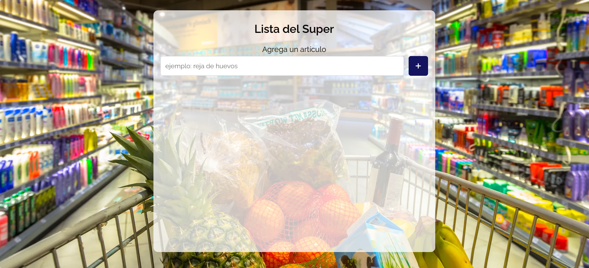
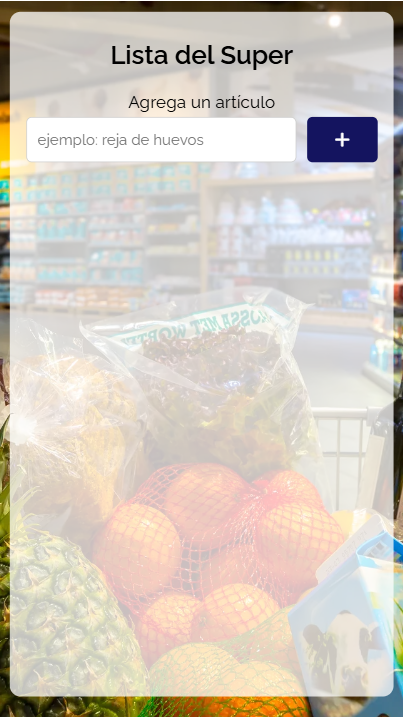

# 🛒 Lista del Súper - Web App

Una aplicación web minimalista y responsiva para crear listas de compras, ideal para uso doméstico. Desarrollada con HTML, CSS y JavaScript puro, y preparada para funcionar con Firebase como backend (próximamente).

Proyecto disponible en [https://fcancinos.github.io/ImprovedToDoList/](https://fcancinos.github.io/ImprovedToDoList/)

## Características actuales

- Interfaz clara y simple para agregar artículos a la lista.
- Funciona desde navegador sin necesidad de servidor backend.
- Interfaz responsiva (adaptada para móvil, tablet y escritorio).
- Los artículos pueden marcarse como "listo" y se mueven automáticamente al final de la lista.
- Botón de borrar por cada elemento.
- Scroll interno en el listado para no ocultar la barra superior.
- Diseño visual cuidado con fuente *Raleway* y fondo centrado.
- Compatible con despliegue en GitHub Pages.

---

##  Vista previa

---

## 📦 Estructura del proyecto

📁 lista-super/

├── index.html # Página principal con el formulario y estructura visual
├── style.css # Estilos responsivos y adaptados
├── hola.js # Lógica de interacción de la lista
├──  README.md # Este documento
└── img # favicons, screenshots y fondos de la aplicación

Proyecto disponible en [https://fcancinos.github.io/ImprovedToDoList/](https://fcancinos.github.io/ImprovedToDoList/)